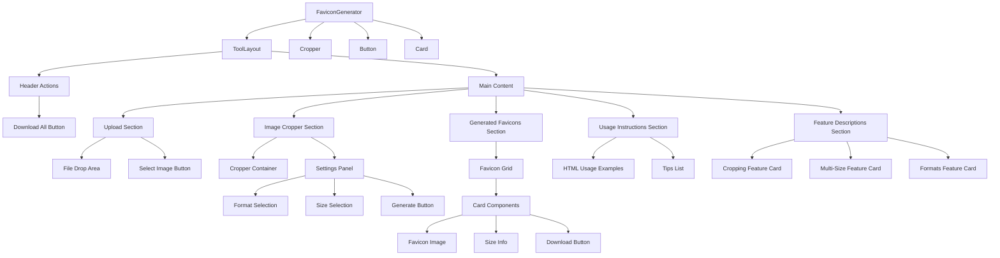

# Favicon Generator Component Structure

```mermaid
graph TD
    A[FaviconGenerator] --> B[ToolLayout]
    A --> C[Cropper]
    A --> D[Button]
    A --> E[Card]

    B --> F[Header Actions]
    B --> G[Main Content]

    F --> H[Download All Button]

    G --> I[Upload Section]
    G --> J[Image Cropper Section]
    G --> K[Generated Favicons Section]
    G --> L[Usage Instructions Section]
    G --> M[Feature Descriptions Section]

    I --> N[File Drop Area]
    I --> O[Select Image Button]

    J --> P[Cropper Container]
    J --> Q[Settings Panel]

    Q --> R[Format Selection]
    Q --> S[Size Selection]
    Q --> T[Generate Button]

    K --> U[Favicon Grid]
    U --> V[Card Components]
    V --> W[Favicon Image]
    V --> X[Size Info]
    V --> Y[Download Button]

    L --> Z[HTML Usage Examples]
    L --> AA[Tips List]

    M --> AB[Cropping Feature Card]
    M --> AC[Multi-Size Feature Card]
    M --> AD[Formats Feature Card]
```
